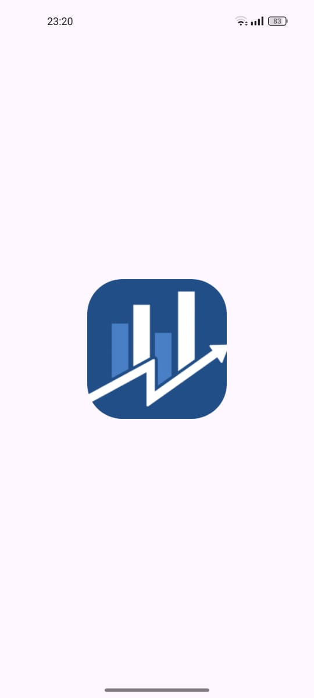
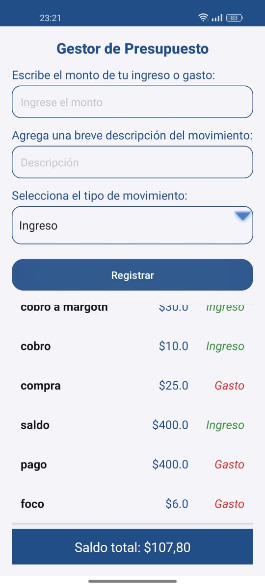
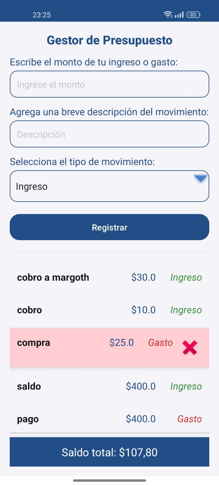

# 💰 MoneyGo  

**MoneyGo** es una aplicación básica de gestión de presupuesto personal desarrollada en Kotlin para Android. Permite registrar ingresos y gastos de forma sencilla, ofreciendo una vista rápida del saldo total y los movimientos realizados.  

## 📋 Funcionalidades  

- **Registro de ingresos y gastos**: Permite al usuario introducir un monto y una descripción.  
- **Selección de tipo de movimiento**: Clasifica cada registro como ingreso o gasto.  
- **Visualización del saldo total**: Muestra el saldo acumulado basado en los movimientos registrados.  
- **Lista de movimientos**: Visualiza en un listado los ingresos y gastos registrados.
- **Borrar movimientos**: Posibilidad de eliminar movimientos seleccionados de la lista para mantener un control actualizado.  
- **Interfaz intuitiva**: Diseño simple y funcional, ideal para usuarios principiantes.  

## 📲 Vista Previa  

    
    
    

  

## 📲 Descargar el APK

Puedes descargar el APK desde el siguiente enlace:  
[Descargar APK](apk)

## ⚙️ Requisitos del Sistema  

- **SDK mínimo**: 21 (Android 5.0 Lollipop)  
- **SDK de compilación**: 35  
- **Entorno de desarrollo**: Android Studio  

## 🚀 Instalación y Ejecución  

1. Clona este repositorio:
2. Abre el proyecto en Android Studio.
3. Sincroniza el proyecto con Gradle.
4. Ejecuta la aplicación en un emulador o dispositivo físico.
